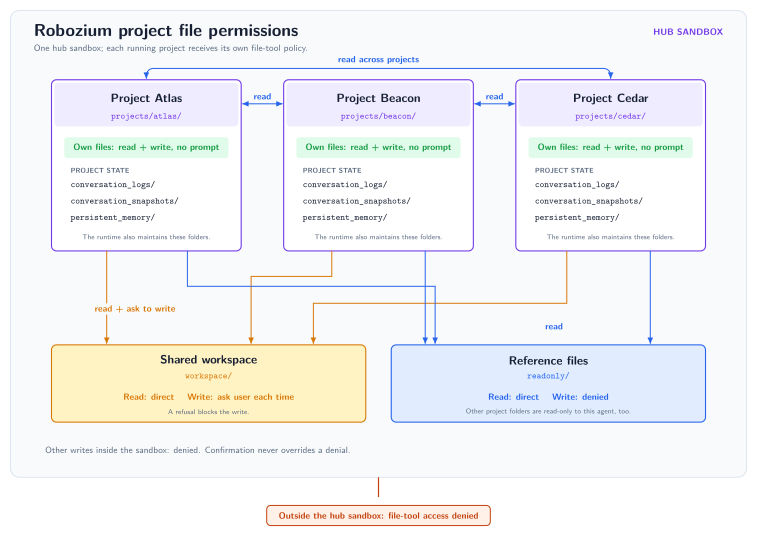

<div align="center">
  <picture>
    <source media="(prefers-color-scheme: dark)" srcset="docs/assets/robozium-title-dark.svg">
    <source media="(prefers-color-scheme: light)" srcset="docs/assets/robozium-title-light.svg">
    
  </picture><br><br>

  <p><strong>Durable agentic projects with custom tools</strong></p>

  <br>

  <p>
    
    
  </p>

  <br>
</div>

Robozium is a multi-agent application built on [RoboZ](https://github.com/Tachion-Oy/roboz). It allows the creation and parallel execution of agentic projects each with their individual memory and scoped tools that prevent unwanted cross-pollination by using a guard layer introduced by RoboZ's tool chaining. The API is built on FastAPI and the UI using NEXT.js. It supports custom tools and their injection as the agent's capabilities.

[](https://github.com/Tachion-Oy/robozium/actions/workflows/ci.yml)
[](LICENSE)

> [!NOTE]
> Robozium and its RoboZ dependency are early-stage software. Configuration,
> behavior, and interfaces may change. See the [changelog](CHANGELOG.md) and
> [known issues](#known-issues).

## Table of contents

- [How it works](#how-it-works)
- [What is it for?](#what-is-it-for)
- [Hub files and permissions](#hub-files-and-permissions)
- [Run](#run)
  - [Optional encrypted credentials](#optional-encrypted-credentials)
  - [Run with API keys](#run-with-api-keys)
- [Configuration](#configuration)
- [Private capabilities](#private-capabilities)
- [Development and contributions](#development-and-contributions)
- [Module map](#module-map)
- [Troubleshooting](#troubleshooting)
- [Known issues](#known-issues)
- [License and credits](#license-and-credits)

## How it works

When the user creates or restarts a project it launches an orchestrator agent along with its librarian background agent with [scoped tool permissions](#hub-files-and-permissions), allowing to work on a specific task. The browser Head-Up-Display (HUD) allows launching several agents in parallel and navigating between their respective runs.

The background librarian continuously snapshots conversations and consolidates a persistent
memory, which supplies context for later runs in the same project.

RoboZ supplies the agent runtime and tool composition. Shed supplies the
orchestrator, librarian, guarded file tools, skills, and deployment recipe.
Endpoints supplies provider adapters and model catalogues. Robozium owns the
browser interface, HTTP API, run lifecycle, credentials, and application choices.
See [RoboZ's documentation](https://github.com/Tachion-Oy/roboz#shed) for the
underlying agent and tool concepts.

All projects are organized within a [hub with the individual project folders as well as a shared workspace and a readonly folder](#hub-files-and-permissions). Files outside the hub are strictly off limits.

Custom tools created with RoboZ can straightforwardly be introduced, see [Private capabilities](#private-capabilities).

## What is it for?

Robozium allows for having long lived specific projects focussed on a specific theme or task, with memory specific to that task and no fear of contamination from other agents due to the fine-grained tool policies preventing unwanted changes. A [shared workspace and readonly locations](#hub-files-and-permissions) allow collaboration of agents in a regimented manner.

With Roboz' tool chaining the user may create their specific tools and (mostly) deterministic workflows and do not have to rely on an off-the-self agent using low level tools with multiple back and forth steps and risking that rules and guidelines given in system prompts and skills are correctly followed.

## Hub files and permissions

The live hub sits beside the clone and is mounted at `/hub` in the API container.
The launcher creates it if missing and reuses it when present.

```text
parent/
├── robozium/             # cloned repository
│   └── .runtime/         # mock data and technical logs
└── Robozium-Hub/         # live hub, mounted at /hub
    ├── readonly/         # reference files
    ├── workspace/        # shared working files
    └── projects/         # project files, history, snapshots, memory
```

Set `ROBOZIUM_HUB_ROOT` in `.env` to choose another live location. It may be
absolute or relative to the repository. Mock runs use `.runtime/mock-hub` and
`.runtime/mock-logs`; live technical logs use `.runtime/logs`.

Each project's file tools can read within the hub and write in that project's
folder. Writes to `workspace/` ask for confirmation. Writes to other projects
and `readonly/` are denied. These are agent file-tool permissions, not an
operating-system sandbox; custom Python code must apply its own appropriate
guards.



Hub files live outside Git history; `.runtime/` is also ignored. Back up these
host directories separately. `docker compose down --volumes` does not delete
them, but older Docker named volumes may still contain user data. Do not use that
command as routine cleanup without identifying and authorizing the exact target.

## Run

Robozium is run from this repository, using Docker Compose on Windows, macOS,
and Linux. Clone it to use the application; a fork is optional. Robozium is not
distributed through PyPI. RoboZ is installed at the version pinned in
[uv.lock](uv.lock), including Shed and Endpoints, so no second checkout is needed.

Install Docker with Docker Compose v2.24 or newer, then clone this repository:

```sh
git clone https://github.com/Tachion-Oy/robozium.git
cd robozium
./start --mock
```

On Windows, use `start.cmd --mock` instead. Open
[http://127.0.0.1:6969](http://127.0.0.1:6969).

Mock mode uses scripted agents and needs no provider keys. It exercises the
interface and persists its own project data separately from the live hub. The
first start builds the application images and downloads their dependencies.

### Optional encrypted credentials

Prefer encrypted API keys when coding agents can inspect the full repository.
Encrypt the marked secrets, remove the plaintext `.env`, and keep the unlock
password outside the checkout and agent conversation. Agents can then inspect
source files without also reading plaintext keys from `.env`. This protects
stored credentials; an agent with access to the running API process or Docker
administration can still access credentials after they are decrypted.

The encryption utility requires [uv](https://docs.astral.sh/uv/getting-started/installation/)
and Python 3.13 or newer on the host. From the repository root, run:

```sh
uv run --locked python -m robozium.secret_env encrypt
```

The command asks for a password and creates `.env.encrypt`. It encrypts
`*_SECRET` values and legacy API-key entries while keeping nonsecret settings
readable. After confirming the file was created, delete the plaintext `.env`.
The launcher reads settings from `.env.encrypt`; unlock **API keys** in the HUD
to load its credentials. RoboZ reads the `*_SECRET` names; the application also
exposes names without the suffix for existing private capabilities.

Set the web port and hub location before encrypting. If both files remain,
`.env` takes precedence for launcher settings. Recreate older encrypted files
after renaming password entries to `_SECRET`; the older encryptor left those
passwords plain. Both credential files are ignored by Git.

### Run with API keys

Copy [.env.example](.env.example) to `.env` (`cp .env.example .env` on
macOS/Linux, or `copy .env.example .env` in Windows Command Prompt). Fill in the
credentials needed by your configured models, then start without `--mock`:

```sh
./start
```

On Windows, use `start.cmd`. The default configuration offers OpenRouter and
Cerebras models. OpenRouter is also needed for the librarian's memory model.
The environment example includes Groq and Proton Bridge settings for capabilities
you configure; live transcription is disabled by default.

Keep credentials in `.env`, which is ignored by Git and excluded from Docker
build context. Credentials are supplied to the API at runtime; never put them in
tracked Python configuration, images, frontend settings, or PR logs.

Before giving a coding agent access to the entire checkout, use
[encrypted credentials](#optional-encrypted-credentials) and remove the
plaintext `.env`. Git ignore rules do not prevent an agent from reading files.

Set `ROBOZIUM_WEB_PORT` in `.env` if port 6969 is busy. The web port binds to
`127.0.0.1`; the API remains on the private Compose network. The launcher stays
attached for logs, and Ctrl+C stops the application without deleting hub files.

## Configuration

[hub.config.py](hub.config.py) contains the application choices:

| Configuration | Purpose |
| --- | --- |
| `NAME`, `SANDBOX` | Application name, hub layout, and persistence folders. |
| `MODELS`, `DEFAULT_MODEL` | Models offered in the HUD and the initial selection. |
| `MEMORY_ENDPOINT` | The librarian's model, independent of the project model. |
| `CAPABILITIES`, `SUBAGENTS` | Additional tool/skill capabilities and specialist agent definitions. |
| `TRANSCRIPTION_ENDPOINT` | Optional speech-to-text endpoint; `None` disables live transcription. |
| `ADDITIONAL_DEPENDENCIES`, `DEPENDENCY_HEALTH` | Extra monitored resources and health-check timing. |
| `LOGGING` | Technical log location. |

Configuration is executable Python and is tracked by Git. Restart native
development after changing it, or rerun the start command to rebuild the Docker
application. Use a branch or fork for source customizations you want to keep,
and review configuration diffs before including them in an upstream PR.

## Private capabilities

Keep custom tools and skills in a root `local/` Python package. This folder is
Git-ignored and excluded from Docker build context and application distributions.
Start with the empty [example package](examples/local/__init__.py):

```sh
mkdir -p local
cp examples/local/__init__.py local/__init__.py
```

On Windows, create `local` and copy the example's `__init__.py` there. Put your
private modules inside that package, import them relatively, and export their
RoboZ capabilities from `local/__init__.py`, for example:

```python
from .my_tools import MyCapability

CAPABILITIES = (MyCapability(),)
```

`MyCapability` must implement RoboZ's `AgentCapability` interface. Existing tools
can instead be grouped with `Capability(tools=(...))`; skills can use
`Capability(skills=(...))` or `auto_loaded_skills`. Local capabilities are appended
after `hub.config.py`'s configured capabilities and bound through the normal
project deployment. No tracked configuration edits are needed.

The API looks beside the selected `hub.config.py`, including when a native
launch uses `ROBOZIUM_CONFIG`. A missing `local/__init__.py`, a missing
`CAPABILITIES` export, or an empty list or tuple adds nothing. Other collection
types and import errors fail configuration loading and identify the local file.
Use relative imports such as `from .my_tools import MyCapability`; the loader
does not add the private folder to Python's import search path.

The launchers create an empty `local/` folder if needed. Docker mounts it
read-only into the API at `/app/local`; private code stays on the host rather
than inside the image. Direct Compose launches must create the folder first.
Restart native development or run `docker compose restart api` after editing
private code, which is imported once per API process. Mock mode keeps its
scripted agents and does not execute private tools, though it still imports
the package while loading configuration.

Keep imports limited to declarations; bind run-specific state when the
capability is built. Private modules use dependencies already installed in the
API environment. Extra packages, host services, and local subagents are not
configured by this scaffold. Back up `local/` separately from Git history.

## Development and contributions

Bug reports, fixes, examples, and documentation improvements are welcome. Small
fixes may go directly to a PR; substantive changes need an approved issue first.
Read [Contributing](CONTRIBUTING.md) for setup, proposal approval, and the PR flow.

For coding-agent work across the repository, prepare
[encrypted credentials](#optional-encrypted-credentials) and delete plaintext
`.env` before granting access. Unlock keys yourself through the HUD when needed;
keep API keys and the unlock password out of agent prompts and its shell
environment. Mock development needs no credentials.

Native development requires Python 3.13 or newer, uv, Node.js, and npm. CI uses
Python 3.13 and Node.js 22. On Linux:

```sh
uv sync --locked --dev
npm --prefix web ci
./scripts/dev.sh --mock
```

Open [http://127.0.0.1:3000](http://127.0.0.1:3000). Omit `--mock` for live
development with `.env` or `.env.encrypt`. The development launcher uses its
own `.runtime/dev-mock-hub` or `.runtime/dev-live-hub` by default; set
`ROBOZIUM_HUB_ROOT` explicitly to select another location. Docker Compose remains
the supported user runtime on all three operating systems.

See [Code style](docs/code-style.md), [Testing](docs/testing.md), and
[Testing practices](docs/testing-practices.md). The
[CI workflow](.github/workflows/ci.yml) defines the PR checks; the
[Full E2E workflow](.github/workflows/e2e.yml) runs after merges to `main` or
manual dispatch. Its wheel and source archive checks validate internal
installation, not PyPI publication.

## Module map

| Location | Provides |
| --- | --- |
| `src/robozium/hub` | Configuration loading, project paths, and deployment bindings. |
| `src/robozium/api` | HTTP routes, runs, prompts, SSE events, credentials, and dependency health. |
| `src/robozium/mock` | Scripted agent and model behavior for demos and tests. |
| `src/robozium/secret_env.py` | Credential encryption and runtime loading. |
| `web/app`, `web/hooks`, `web/lib` | Next.js HUD, API proxy routes, and browser session state. |
| `hub.config.py`, `compose.yaml`, `Dockerfile` | Application choices and supported deployment. |
| `scripts`, `tests`, `web/tests`, `web/e2e` | Development helpers, backend checks, frontend tests, and browser suites. |

## Troubleshooting

From the repository root, check container status and recent logs:

```sh
docker compose ps
docker compose logs --tail=200 api web
```

Check the HUD's dependency status and API-key controls when a live provider is
unavailable. For a reproducible bug, include the commit, mode, operating system,
and sanitized logs in an [issue](https://github.com/Tachion-Oy/robozium/issues).
Report vulnerabilities privately using [Security](SECURITY.md).

## Known issues

- A delayed run poll can replace a newer status with an older one.
- A failed project refresh can hide the project list; a failed reply has no clear error message.
- Run snapshot timestamps are generated when normalized and can differ between renders.

## License and credits

Robozium is licensed under the [Apache License 2.0](LICENSE).

Brand lettering uses Pirulen artwork by Raymond Larabie
([usage terms](https://typodermicfonts.com/license/)). The HUD status mark uses
Anurati A. Third-party assets retain their respective usage terms.
